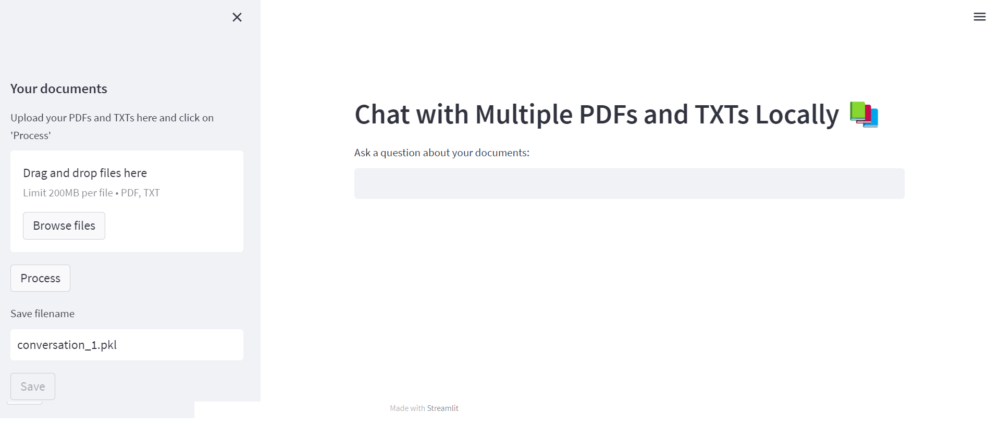

## Using the Chatbot

1. **Using Python Terminal:**

2. **Clone the repository**:
    ```sh
    git clone 
    ```

3. **Download requirements**:
    ```sh
    pip install -r requirements.txt
    ```

4. **Run Ollama with the selected LLM**:
	The default LLM is "mistral". You can choose other LLMs from the supported libraries on the Ollama website: [Ollama Library](https://ollama.com/library).
    Make sure you update the variable "model_name" inside the OfflineRAGapp.py also if you want to change the LLM library
	```sh
    ollama pull mistral
    ```

5. **Run the application**:
    ```sh
    streamlit run OfflineRAGapp.py
    ```


6. **Launching the Application**:
	Upon launching the application, the server interface will be displayed in the internet browser, as shown in the image below. You have different options to apply:

	- **Option 1: Upload New Documents**:
		You have the option to upload your own documents or utilize the two documents provided in the example folder. These documents, generated by ChatGPT, contain valuable information about dams.
		Once you click the "Process" button, the text will undergo chunking and embedding processes, resulting in two separate text files. Examples of these resulting files can be found in the example folder for reference.
		- **Start the Conversation**: After the application finishes processing, you will be able to start the conversation.

	- **Option 2: Load a Previous Conversation**:
		Load a previously saved conversation and continue the conversation from where you left off. You can use the `damsConversation.pkl` file in the example folder provided in this repository.

	After creating a new conversation or loading a previous one, you have the following options:

	- **Option 1: Save the Conversation**:
		Save the current state of the conversation to a file.

	- **Option 2: Clear the Conversation**:
		Clear the conversation history and start from the beginning.
		



## Explanation of Main Functions

The image illustrates the overall steps of the model. It begins with uploading multiple PDF files, followed by processing them before engaging in conversation, as outlined below:

1. Call the `get_pdf_text(pdf_docs)` function to read and concatenate text from each page of the uploaded PDF documents.
   - **Main method** for parsing: PyPDF2 library.
   - **Output**: raw_text

2. Call the `get_text_chunks(raw_text)` function to split the extracted text into manageable chunks.
   - **Main method**: langchain library.
   - **CharacterTextSplitter Parameters**: chunk size: 1000 characters, overlap: 200 characters.
   - **Output**: text_chunks

3. Call the `get_vectorstore(text_chunks)` function to generate embeddings for the text chunks and store them in a vector database.
   - **Main method**:
     - **Embeddings**: our model use Mistral LLM, other supported models could be found at [Ollama Library](https://ollama.com/library)
     - **FAISS**: A library for efficient similarity search  A library that allows developers to quickly search for embeddings of multimedia documents that are similar to each other. [More info](https://engineering.fb.com/2017/03/29/data-infrastructure/faiss-a-library-for-efficient-similarity-search/)
   - **Convert the embeddings vectorspace to txt file (embeddings.txt)**

4. Call the `get_conversation_chain(vectorstore)` function to create a conversational chain with the generated vectorstore.
   - **This operation relies on the langchain library for creating conversational chains.**

5. **Save State Function**
   - Call the `save_state(filename)` function to save the current state of the conversation.
   - **Parameters**: 
     - `filename`: The name of the file to save the state.
   - **Main method**: 
     - Uses the `pickle` library to serialize and save the current conversation state (conversation and chat history) to a file.
   - **Output**: State saved successfully message.

6. **Load State Function**
   - Call the `load_state(filename)` function to load a previously saved conversation state.
   - **Parameters**: 
     - `filename`: The name of the file to load the state from.
   - **Main method**:
     - Uses the `pickle` library to deserialize and load the saved conversation state (conversation and chat history) from a file.
     - Populates the chat display directly and triggers an update to reflect the loaded state.
   - **Output**: State loaded successfully message or error if no saved state is found.

7. **Clear Conversation Function**
   - Call the `clear_conversation()` function to clear the current conversation, chat history, and chat display.
   - **Main method**:
     - Resets the session state variables `conversation`, `chat_history`, and `chat_display` to their initial values.
     - Triggers an update to reflect the cleared state.
   - **Output**: Conversation cleared and the interface is reset.
